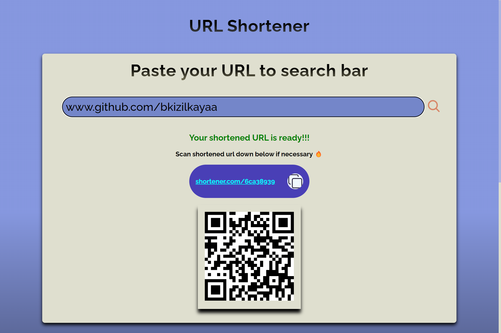
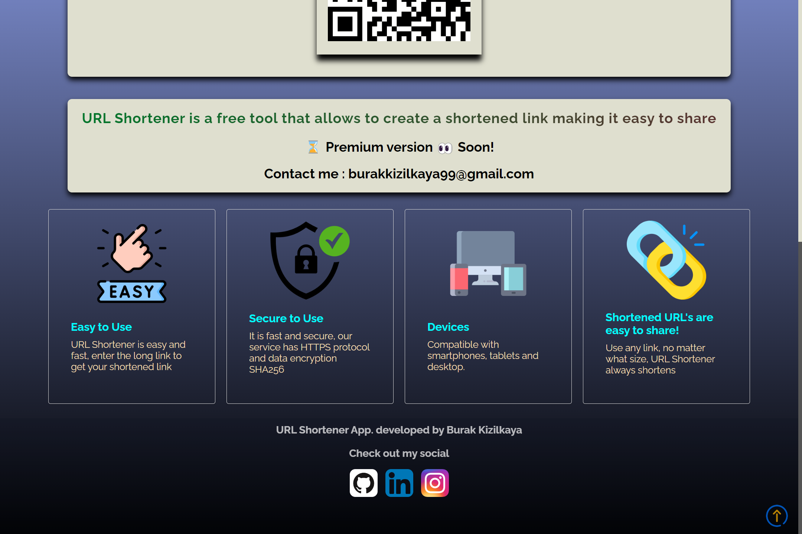
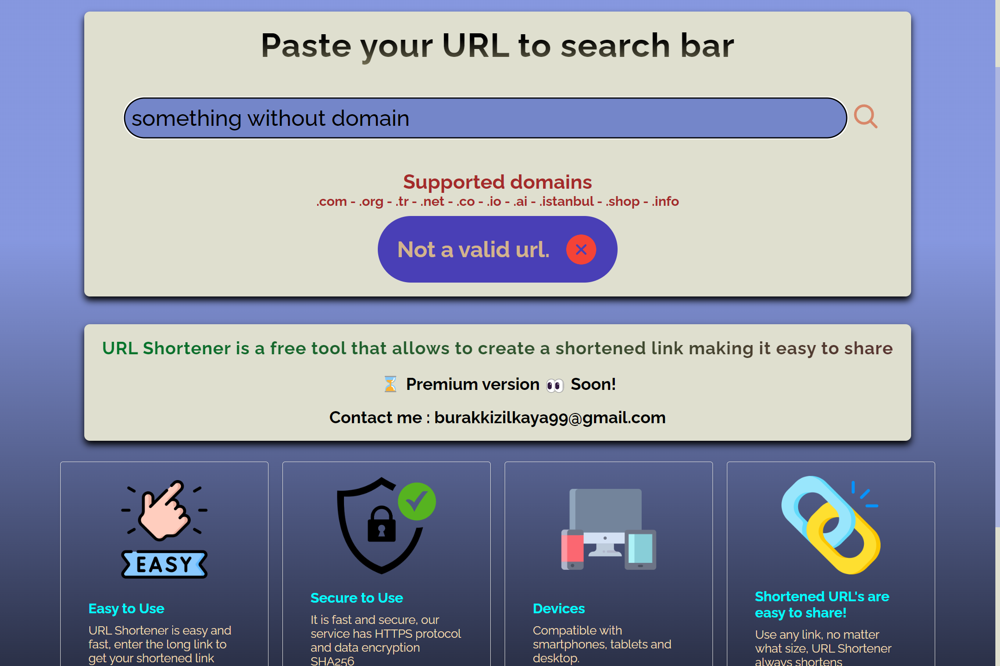
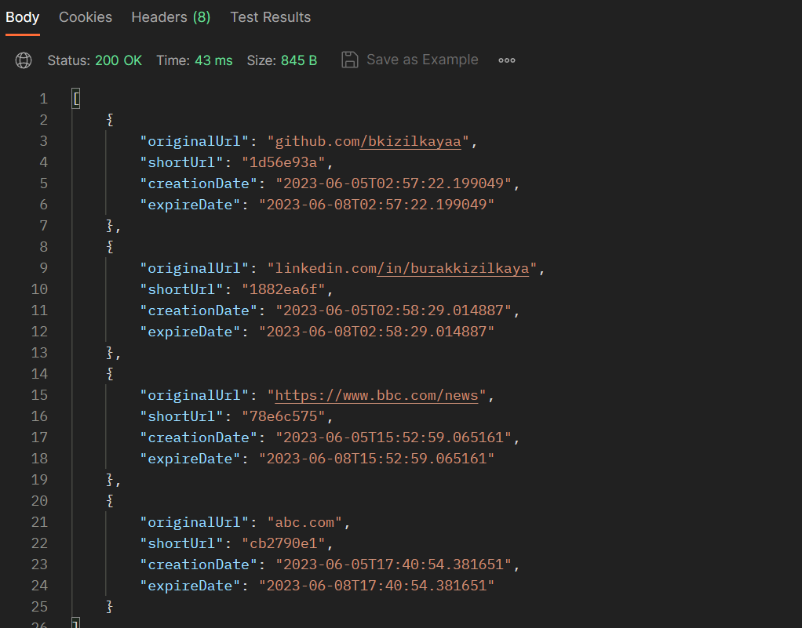

<h1> URL Shortener </h1>

## **This is a full-stack project where users can easily create shortened and encrypted URLs.**

### API Explanation at the end.

<br/>
<br/>


https://github.com/bkizilkayaa/url-shortener/assets/88281419/94f0a186-45e2-4d41-9b25-6618a6b0fa1a

<br/>

<br/>

<br/>
<br/>

## If there is no valid domain input:

<br/>



<br/>

# **API Explanation** 

## 1-) Get All Shortened URLs 

### Method: GET

### Param: No Param

### Result: Gets All Records

### Status: 200

```diff
+ localhost:8080/api/v1/url
```


<br/> <br/>

## 2-) Generate Shortened URL 

### Method: POST

### Param: Original Link Required (json form)

### Result: Creates a record

### Status: 201 Created

```diff
+ localhost:8080/api/v1/url
```

<br/>

## 3-) Get Original URL

### Method: GET

### Param: Shortened Link

### Result: Redirects original link

### Status: 200

```diff
+ localhost:8080/api/v1/url/{shortLink}
```

<br/>

## 4-) Delete Shortened URL

### Method: DELETE

### Param: Shortened Link

### Result: Removes the record from the database

### Status: 200 (Everything is OK)

```diff
+ localhost:8080/api/v1/url/{shortLink}
```

<br/>

#### This project is running on localhost. The video shows a domain like "shortener.com" but that domain does not belong to me. I just added it that way to make it look nice. If I buy the domain one day, the url will look like that. 
